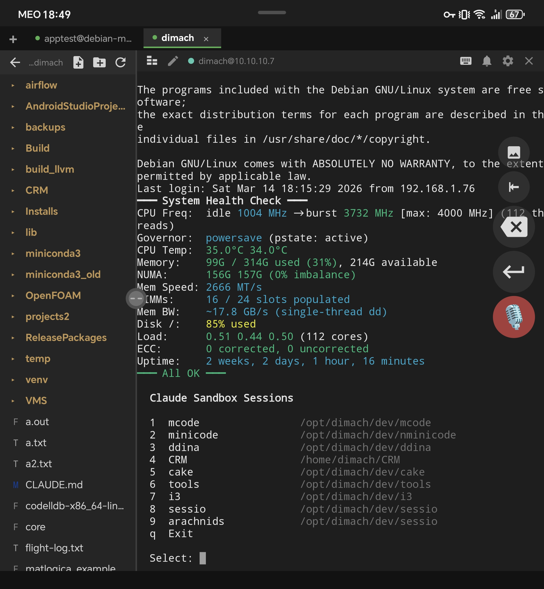
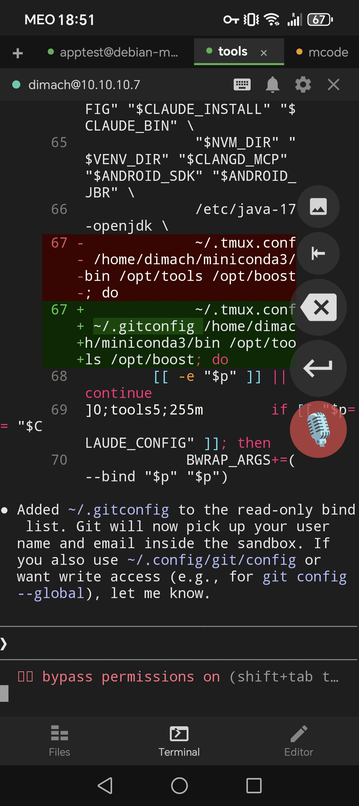

# MiniCode

Native Android SSH terminal and code editor, designed for foldable devices and tablets.

## Features

- **SSH Terminal** — Full VT100/xterm-256color terminal emulator via Apache MINA SSHD
- **Code Editor** — Syntax highlighting for 30+ languages using sora-editor with TextMate grammars
- **SFTP File Tree** — Browse, create, rename, and delete remote files
- **Split Layout** — Side-by-side file tree, editor, and terminal on foldable/tablet displays (600dp+)
- **Multi-Session SSH** — Tabbed interface for multiple concurrent connections
- **Voice Input** — Hold mic button to dictate commands; supports Google Speech
- **Bell Notifications** — Terminal BEL character triggers vibration and/or chime (configurable)
- **Floating Toolbar** — Draggable Esc/Backspace/Enter/Mic buttons, adjusts for keyboard
- **Keyboard Toolbar** — Optional Ctrl/Alt/Tab/Esc/arrow keys bar
- **Fold/Unfold** — Seamless transition between cover and inner display without losing session
- **Persistent Connections** — Foreground service with wake/wifi locks survives long network outages

## Build

```bash
./gradlew assembleFossDebug
```

Install on device:
```bash
adb install app/build/outputs/apk/foss/debug/app-foss-debug.apk
```

## Screenshots

<p float="left">
  
  
</p>

## Bell Notifications

MiniCode's terminal responds to the BEL character (`\a` / `0x07`) with vibration and/or chime. Toggle the mode via the bell icon in the terminal header bar (cycles: off / vibrate / vibrate+chime).

## File Tree Follows Terminal Directory

MiniCode can automatically update the SFTP file tree when you `cd` in the terminal. Your shell needs to emit [OSC 7](https://invisible-island.net/xterm/ctlseqs/ctlseqs.html) after each command:

**bash** — add to `~/.bashrc`:
```bash
__minicode_osc7() {
    printf '\e]7;file://%s%s\a' "$HOSTNAME" "$PWD"
}
PROMPT_COMMAND="__minicode_osc7${PROMPT_COMMAND:+;$PROMPT_COMMAND}"
```

**zsh** — add to `~/.zshrc`:
```zsh
chpwd() {
    printf '\e]7;file://%s%s\a' "$HOST" "$PWD"
}
```

## Releases

### v1.3.0 (build 13)

- Initial public release
- Full terminal emulator with xterm-256color support
- Code editor with syntax highlighting for 30+ languages
- SFTP file browser with create, rename, delete
- Split-panel layout for foldable devices and tablets
- Multi-session SSH with tabbed interface
- Voice input support
- Persistent SSH connections via foreground service

### Downloads

| Flavor | Download |
|--------|----------|
| FOSS (5 MB) | [minicode-foss-1.3.0.apk](https://minicode.app/minicode/releases/minicode-foss-1.3.0.apk) |

Also available on [F-Droid](https://f-droid.org) (pending) and [Google Play](https://play.google.com/store/apps/details?id=com.minicode) (pending).

## Architecture

- MVVM with Hilt DI, Kotlin coroutines, StateFlow
- Custom TerminalEmulator (VT100/xterm-256color) with TerminalBuffer
- Apache MINA SSHD for SSH/SFTP
- sora-editor (Rosemoe) 0.23.6 with TextMate grammars for syntax highlighting
- Foldable support via `configChanges` handling (no activity recreation on fold/unfold)

## License

AGPL-3.0 — see [LICENSE](LICENSE)
